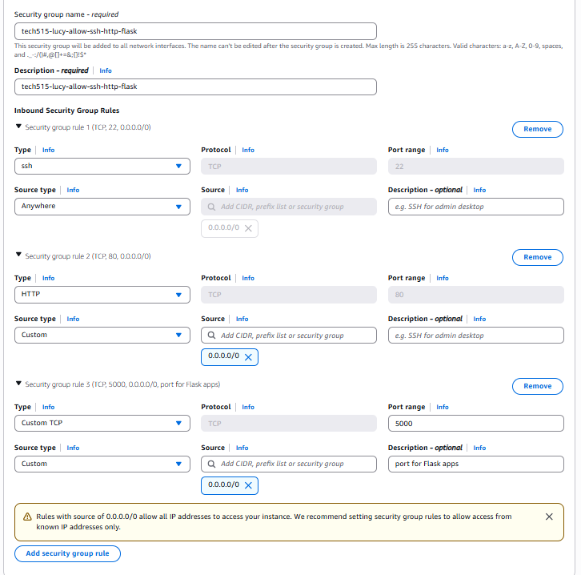
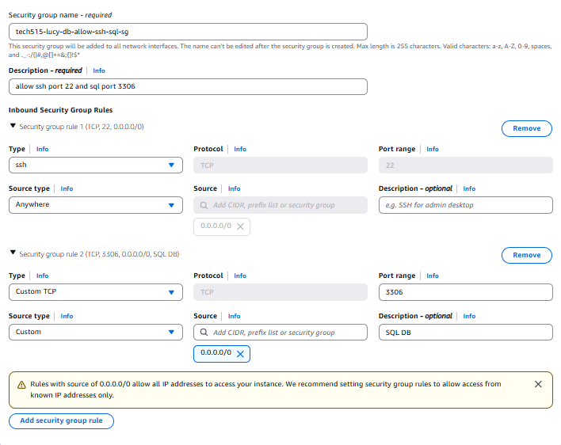
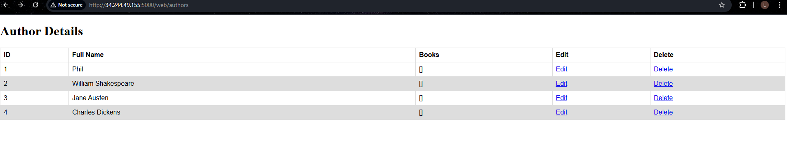
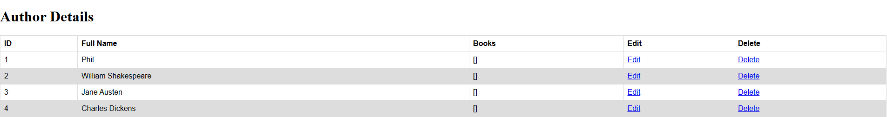
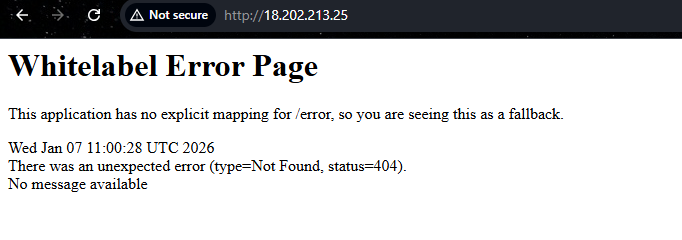
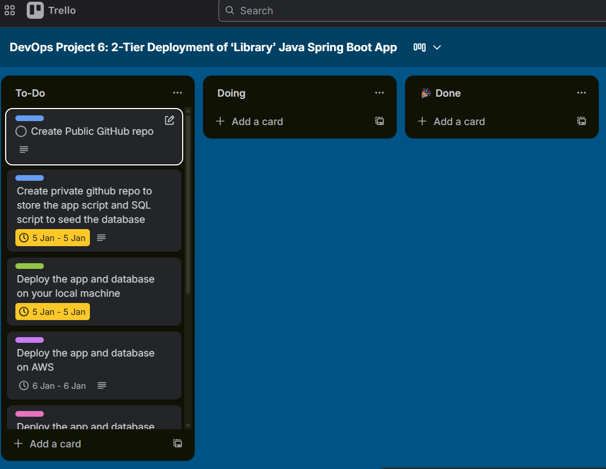

# tech515-java-project6

## Brief

🥅 implement the 2-tier deployment of a Java Spring Boot app using various methods, including virtualisation and containerisation

- 6 days max
- do everything in 5 days and tie up on 6th day

**Project Components:**
- Public GitHub repo containing everything needed for the above, and a README file with
  - Sections for each stage of the project
  - Steps to follow to get that stage working, along with appropriate explanations and notes about important learning
  - Diagrams showing your architecture of each stage
  - Blockers – Suggestion: what was the issue, reason for the issue, solution
  - What you learnt
  - Benefits you saw personally from the project
- Project Management: Maintain a project board (e.g., Trello, Jira or GitHub Project) to manage tasks

**Deliverables:**

1. A 5-minute video which explains what you did and what you learned in this project. The target audience is a non-technical stakeholder. The focus of your video should be the last stage of the project you got up to.

Your video should include:
- Project board – how did you conduct this project?
- Discussion of the components
- Demonstration of the working system


2. Documentation/Code Package:

- PDF copy of the README
- Link/invitation to project repo

3. End of Project Feedback Form:

- After completing the project and handing in the above deliverables, spend 2-5 min to fill-in the feedback form
- Give as much detail as possible in the last box · Follow this link: https://forms.office.com/e/M5QdiKKrK4


---

## Stage 1: Create GitHub repo

🥅 Create a private GitHub repository to store the Java app and SQL script to seed the database (check your course’s Teams channel’s file section for it or ask your trainer for the ‘library-java17-mysql-app' zip file of the app code). Use the README.md file included with the app code to understand the app

**Stage Components:**
- Private GitHub repo for the storage of the app code and SQL script to seed the database. You will need this to do your `git clone` from

- I created a GitHub repository named 'tech515-Java-Spring-Boot-App' and stored the ‘library-java17-mysql-app' file it it
- I created a GitHub repository named 'tech515-java-project6' to store all notes in for this project

---

## Stage 2: Deploy the app and database

🥅 Deploy the app and database on your local machine (½ day)

REMEMBER TO INCLUDE:

- Steps to follow to get that stage working, along with appropriate explanations and notes about important learnings

- Diagrams showing your architecture of each stage

- Blockers – Suggestion: what was the issue, reason for the issue, solution

- What you learnt

### App Overview

"Library" Java-Springboot app
- Built with Maven
- Runs on Java 17
- Backend service (not a Node app)
- Uses a MySQL database in the backend
- Includes a...
    - GUI and
    - API

### Set up app VM

Requirements:
- Hardware
  - AWS t3.small memory
- Software
  - Ubuntu 22.04 LTS (Can run on Windows 10/11 also)
  - Maven
  - Java 17
  - ProjectLibrary2 is the app folder

Environment Variables:
- Variable name: DB_HOST
    - Description: Acts like a connection string
    - Value: jdbc:mysql://$DATABASE_IP:3306/library
- Variable name: DB_USER
  - Description: The username setup in your MySQL database
  - Value: Can be whatever what you want to setup
- Variable name: DB_PASS
  - Description: The password setup in your MySQL database
  - Value: Can be whatever what you want to setup

Security Groups:



### Set up MySQL VM

Requirements:
- Hardware
  - AWS t3.small memory
- Software
  - Ubuntu 22.04 LTS (Can run on Windows 10/11 also)
  - MySQL database
  - Database must be seeded via an SQL script library.sql

Security Groups:



| Type         | Port | Source                 |
| ------------ | ---- | ---------------------- |
| MySQL/Aurora | 3306 | **App Security Group** |

⚠️ Do NOT use 0.0.0.0/0 for MySQL.

In AWS console:

Source → Security group

Select your app security group

This allows:

App VM → DB VM
But blocks everyone else 🚫

### Run DB code

I need a library.sql SQL file that contains the INSERT statements for all the data I want in the authors table

### Run app code

1. go into app folder 'ProjectLibrary2'
2. run app in the background

`mvn spring-boot:start`

3. stop app running

`mvn spring-boot:stop`

I don't need npm as this is a Java Sprint Boot app, not a Node.js app

**My Steps**

copy github private key onto app vm so I can clone the app onto the vm:

On my machine:

scp -i ~/.ssh/tech515-lucy-aws.pem ~/.ssh/lucy-github-key ubuntu@34.244.49.155:~/.ssh/lucy-github-key

On the EC2:

chmod 600 ~/.ssh/lucy-github-key # give read write permissions in vm

Then configure SSH for GitHub (as previously):

nano ~/.ssh/config

Host github.com
  HostName github.com
  User git
  IdentityFile ~/.ssh/lucy-github-key

chmod 600 ~/.ssh/config

Then:

eval "$(ssh-agent -s)"
ssh-add ~/.ssh/lucy-github-key
ssh -T git@github.com


1. Install dependencies
On your Ubuntu VM:
sudo apt update && sudo apt install -y nodejs npm
If your app needs a specific Node version (e.g., Node 20):
curl -sL https://deb.nodesource.com/setup_20.x | sudo -E bash -
sudo apt install -y nodejs
________________________________________
1. Clone the Sparta app
git clone https://github.com/<your-repo>/tech515-sparta-app.git
Then:
cd tech515-sparta-app/app
This folder contains app.js.
________________________________________
1. Install app packages
Inside the app folder:
npm install
This installs:
•	Express
•	Mocha
•	Supertest
•	Mongoose
•	Any other dependencies from package.json
________________________________________
1. Set the MongoDB connection environment variable
Your backend needs DB_HOST so it knows where MongoDB is.
Example:
export DB_HOST="mongodb://<DB_PRIVATE_IP>:27017/posts"
Example using your real value:
export DB_HOST="mongodb://172.31.17.218:27017/posts"
Check it:
echo $DB_HOST
________________________________________
1. Start the backend app
Option A — Run directly (manual)
node app.js
or:
npm start
You will see:
App is running on port 3000 Node.js / Express apps often run on localhost:3000
Keep this window open — or use tmux if needed.
________________________________________
Option B — Run with PM2 (recommended for production)
Install PM2:
sudo npm install -g pm2
Start the app:
pm2 start app.js --name sparta-app --update-env
Save the process list so PM2 restarts it after reboot:
pm2 save
Check PM2 status:
pm2 status
________________________________________
1. Optional — Set up Nginx reverse proxy
If you want to expose the app on port 80:
Edit /etc/nginx/sites-available/default and change:
try_files $uri $uri/ =404;
to:
proxy_pass http://127.0.0.1:3000;
Then restart nginx:
sudo systemctl restart nginx
Your app will now be available at:

```
proxy_pass http://127.0.0.1:3000;

This tells Nginx to forward requests to a server running on 127.0.0.1:3000.
```

### Test the app is running

ℹ️ If you have a reverse proxy working, you won't need to include the port number in the address. For example: http://34.245.124.148:5000/authors would become http://34.245.124.148/authors

Otherwise, go to <ip-address>:5000

There is no explicit mapping for the base URL (base path), so you should get an error like this: java-mysql-app-whitelabel-error-page

http://34.244.49.155:5000/web/authors





---

## Stage 3: Deploy the app and database on AWS using VMs

🥅 Deploy the app and database on AWS or Azure using Virtual Machines. Automate it via Bash provision scripts that work in user data. (1 day)

**Stage Components:**
- Bash provision scripts for app and database VMs that runs in user data


REMEMBER TO INCLUDE:

- Steps to follow to get that stage working, along with appropriate explanations and notes about important learnings

- Diagrams showing your architecture of each stage

- Blockers – Suggestion: what was the issue, reason for the issue, solution

- What you learnt

---

## Stage 4: Deploy the app and database on AWS using containers running on VM

🥅 Deploy the app and database on AWS or Azure using containers running on a Virtual Machine (Docker Compose). Automate it via Bash provision scripts that work in user data. (1-2 days)

**Stage Components:**
- **Bash provision script** for a single VM that runs in user data but deploys the app and database using containers on the one machine. The containers run by the script should use Docker images already uploaded to Docker Hub.

- **Docker-related files**
  - Dockerfile files
  - Docker-compose YAML file
  - Dockerised application images built and ready for deployment

What CHANGES 🔄
Before (Harder)	> Now (Cleaner)
Two VMs >	One VM
Install Java manually >	Java lives inside a container
Install MySQL manually >	MySQL container
Open DB ports	> Docker network
Manage system services >	Docker Compose does it
Debug OS issues	> Containers are isolated

How your architecture changes
❌ Before (VM-based)
EC2 (App VM)
 ├ Java
 ├ Maven
 ├ Nginx
 └ Spring Boot

EC2 (DB VM)
 └ MySQL

✅ Now (Docker-based)
EC2 (1 VM)
 ├ Docker
 └ Docker Compose
     ├ App container (Java + Spring Boot)
     └ MySQL container


Same idea — less setup.

My Steps 

1️⃣ Learn Docker basics

**Docker image** - a read-only template that defines your container. The image contains the code that will run including any definitions for any libraries and dependancies your code needs. 

Using Docker, you can quickly deploy and scale applications into any environment and know your code will run. You can do this because **Docker packages software into standardized units called containers** that have everything the software needs to run including libraries, system tools, code, and runtime.

The Docker Engine is installed on each server you want to run containers on and provides a simple set of commands you can use to build, start, or stop containers.

Running Docker on AWS provides developers and admins a highly reliable, low-cost way to build, ship, and run distributed applications at any scale.

Think of each container as a preconfigured mini VM

Key Commands:

1. `docker ps`
- run inside VM to see the containers
- output example:
  ```
  CONTAINER ID   IMAGE         NAME
  abc123         mysql:8.0     library-db
  def456         app-image     library-app
  ```
2. `docker logs`
- this command batch-retrieves logs present at the time of execution
- `docker logs --details` command will add on extra attributes, such as environment variables and labels
- `docker logs --timestamps` command will add an RFC3339Nano timestamp
3. `docker-compose up`
- we add this to the user data to create the containers


2️⃣ Create Dockerfile (for the app)

This replaces:
- installing Java
- installing Maven
- running mvn

⭐ So no systems are installed

>🧠 Think of the Dockerfile as: A recipe for the app container

We create this file in the root of our repo:

Dockerfile (no extension!)
```
# Use Maven + Java to build the app
FROM maven:3.9.6-eclipse-temurin-17 AS build

WORKDIR /app
COPY . .
RUN mvn clean package -DskipTests

# Run stage (lighter image)
FROM eclipse-temurin:17-jre

WORKDIR /app
COPY --from=build /app/target/*.jar app.jar

EXPOSE 5000

ENTRYPOINT ["java", "-jar", "app.jar"]
```
- I created this and changed permissions to execute

What this does
Line	> Meaning
FROM maven...	> Gets Java + Maven preinstalled
mvn clean package >	Builds your Spring Boot app
FROM ...jre	> Smaller runtime image
EXPOSE 5000	> Your app port
ENTRYPOINT	> Runs the app


3️⃣ Create docker-compose.yml (main task)

This replaces:

- DB VM script
- App VM script
- networking
- port forwarding

>🧠 Think of the docker-compose.yml file as: The blueprint for the containers

👉 The containers are created by `docker-compose up` in the user data

👉 What gets created is defined in `docker-compose.yml`


You’ll end up with:
```
repo/
├ Dockerfile
├ docker-compose.yml
├ library.sql
└ README.md
```

Create docker-compose.yml file

```
version: "3.8"

services:
```
this bit builds MySQL container (create a container from the MySQL image)
```
  db:
    image: mysql:8.0
    container_name: library-db
    restart: always
    environment:
      MYSQL_DATABASE: library
      MYSQL_USER: lucysteve
      MYSQL_PASSWORD: strongpassword
      MYSQL_ROOT_PASSWORD: rootpassword
    volumes:
      - db_data:/var/lib/mysql
      - ./library.sql:/docker-entrypoint-initdb.d/library.sql # MySQL automatically runs library.sql on first start (this bit seeds the database)
    ports:
      - "3306:3306"
```
this bit builds APP container (build an image using the Dockerfile in this folder, then run it as a container)
```
  app:
    build: .
    container_name: library-app
    restart: always
    depends_on:
      - db
    ports:
      - "80:5000"
    environment:
      DB_HOST: db
      DB_USER: lucysteve
      DB_PASS: strongpassword
volumes:
  db_data:

```

- I created this and changed permissions to execute


🔑 Important:

DB_HOST: db

db is the service name

Docker automatically creates DNS

Your app connects to MySQL without an IP

depends_on

Ensures DB starts before app

80:5000

Browser → port 80

Container → port 5000


4️⃣ Create User data script (fully automated)

This replaces your old:
- Java install
- Maven install
- MySQL install
- Nginx config


Create user data

```
#!/bin/bash

echo "=== Updating system ==="
apt update -y

echo "=== Installing Docker ==="
apt install -y docker.io docker-compose git

echo "=== Enable Docker ==="
systemctl start docker
systemctl enable docker

# Allow ubuntu to run docker
usermod -aG docker ubuntu

echo "=== Cloning repo ==="
cd /home/ubuntu
git clone https://github.com/lucystevenson/tech515-Java-Spring-Boot-App.git
cd tech515-Java-Spring-Boot-App

echo "=== Starting containers ==="
docker-compose up -d

echo "=== Done ==="
```
Check containers have been created
- ssh into VM
- command `docker ps` to see containers


What does `docker-compose up -d` do?
- It creates the containers

How?

1. Docker reads docker-compose.yml
2. Sees db

  - pulls MySQL image
  - creates MySQL container

3. Sees app

  - builds image using Dockerfile
  - creates App container

4. Connects them on a private Docker network

5. Starts them


5️⃣ Create EC2 on AWS

- create just 1 VM
- set up security groups to open port 5000
- add user data above

CHECK:
1. check containers are running `docker ps`
2. check logs
  - app: `docker logs library-app`
  - db: `docker logs library-db`
3. test app in browser: http://54.155.143.32/

REMEMBER TO INCLUDE:

- Steps to follow to get that stage working, along with appropriate explanations and notes about important learnings

- Diagrams showing your architecture of each stage

- Blockers – Suggestion: what was the issue, reason for the issue, solution

- What you learnt


---

## Stage 5: Deploy the app and database on AWS using Kubernetes 

🥅 Deploy the app and database on AWS or Azure using Kubernetes (Minikube) running on a Virtual Machine. Automate it via Bash provision scripts that work in user data. The Bash scripts could deploy on Kubernetes via applying YAML definition files or (optional) using a Helm chart. (1-2 days)


**Stage Components:**
- **Bash provision script** for a single VM that runs in user data, but provisions and deploys the app and database using Kubernetes (and optionally Helm) on the one machine

- **Kubernetes-related files**
  - YAML definition/configuration files
  - (Optional) Helm chart and values YAML files

REMEMBER TO INCLUDE:

- Steps to follow to get that stage working, along with appropriate explanations and notes about important learnings

- Diagrams showing your architecture of each stage

- Blockers – Suggestion: what was the issue, reason for the issue, solution

- What you learnt

## Benefits I saw personally from the project


## Deliverable Help

Trello board at the start:
